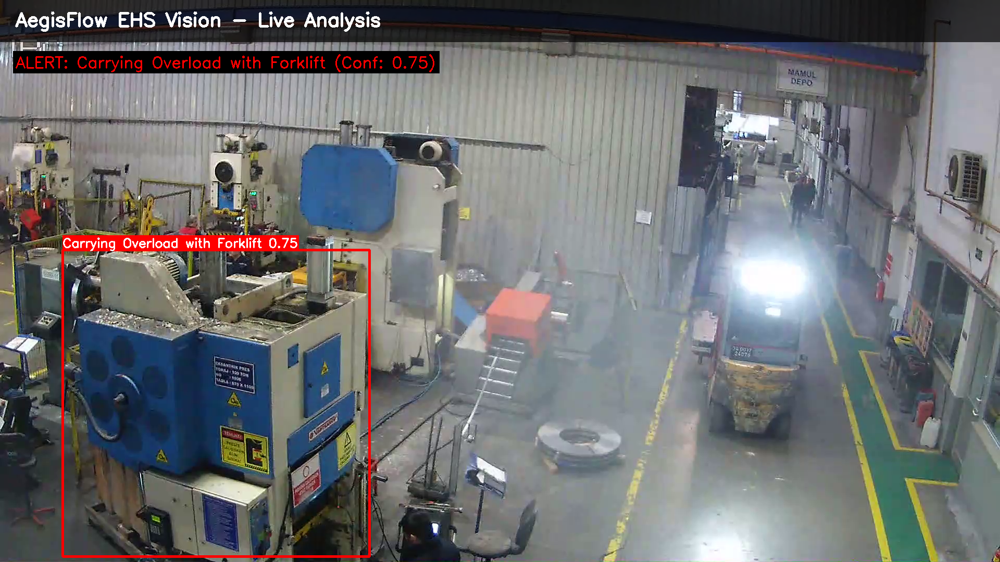
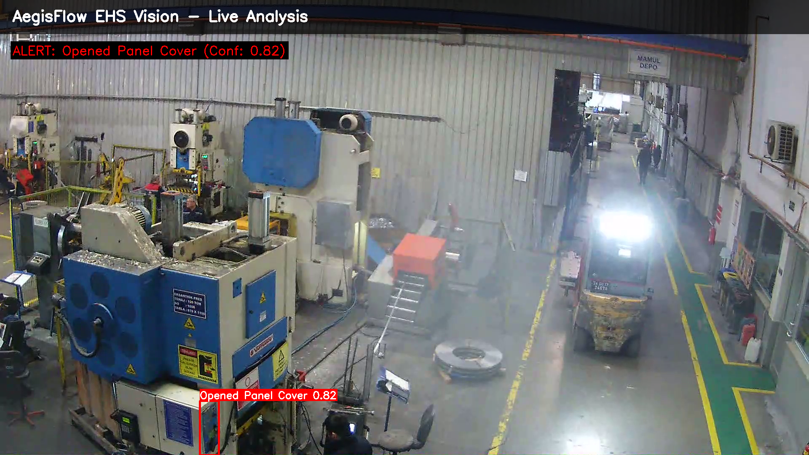
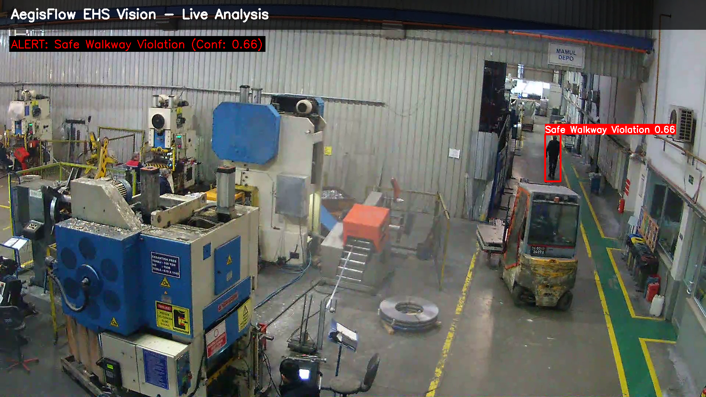
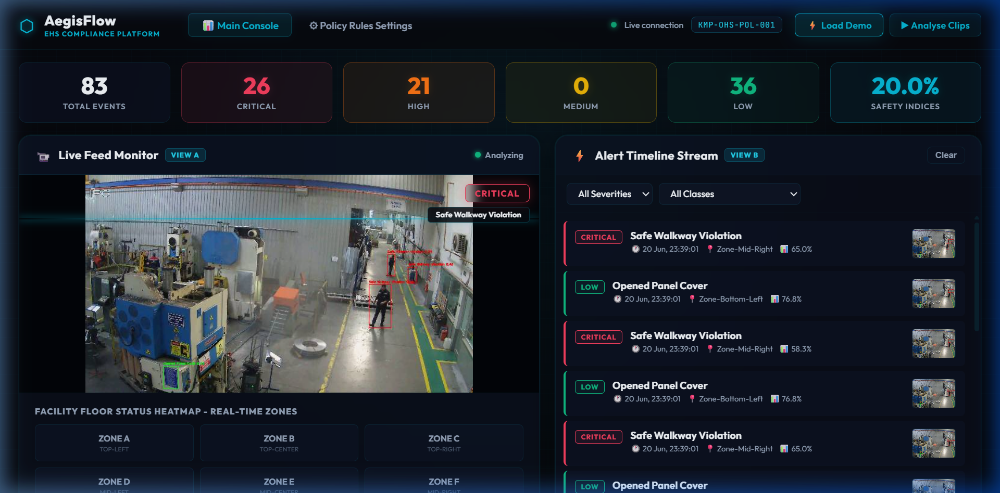
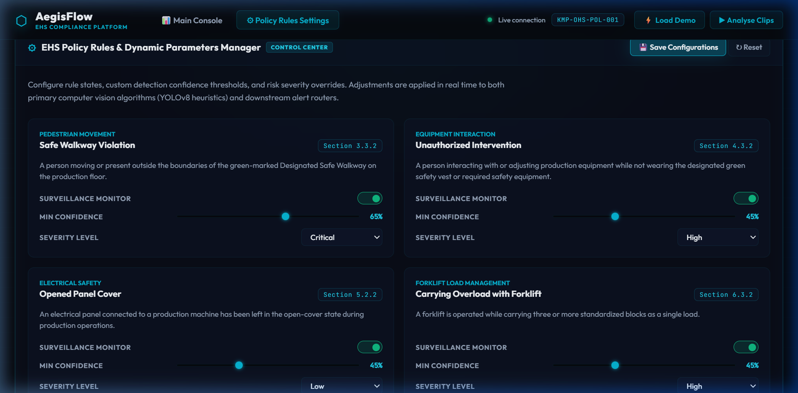
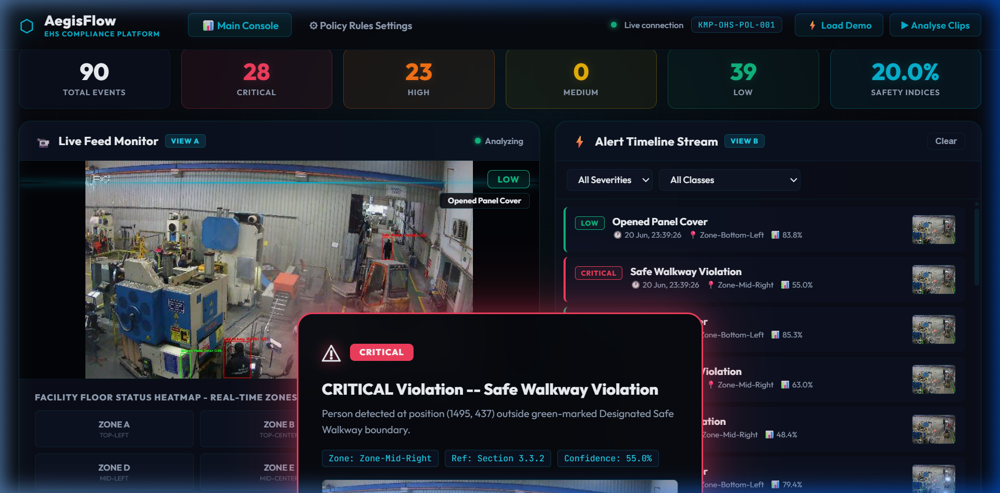
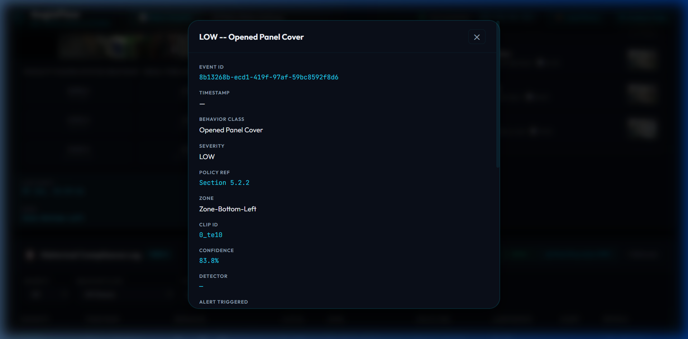

# AegisFlow EHS Vision Platform

<div align="center">

[](https://www.python.org/)
[](https://fastapi.tiangolo.com/)
[](https://ultralytics.com/)
[]()

**An end-to-end automated compliance monitoring system for factory environments.**  
Built against policy document **KMP-OHS-POL-001** — *Occupational Health & Safety Compliance Policy Manual*.

</div>

---


## 🎬 Live System Demonstration

### Computer Vision Pipeline in Action

*Annotated frame-by-frame processing demonstrating real-time bounding box tracking, behavior classification, and confidence scoring directly over raw factory footage.*

---

## 📸 Automated Test Cases Showcase

The pipeline rigorously classifies various safety violations and highlights them immediately with visual overlays. Below are live test case captures from the classification engine:

| **Forklift Overload Violation** | **Unsecured Electrical Panel** |
|:---:|:---:|
|  |  |
| *Identifies forklifts carrying 3+ load blocks simultaneously* | *Detects unlatched electrical cabinets and panels* |

| **Pedestrian Walkway Intrusion** |
|:---:|
|  |
| *Flags personnel operating outside of designated green safety perimeters* |

---

## 💻 Dashboard UI Screenshots

| **Dashboard Live Monitor & Heatmap** | **Dynamic Rule Configurations** |
|:---:|:---:|
|  |  |
| *Real-time alert timeline and zone heatmap* | *Dynamic control of confidence thresholds and risk policies* |

| **Executive Audit Modal** | **Compliance Logs Export** |
|:---:|:---:|
|  |  |
| *Severity-based flash alerts for critical violations* | *Drill-down view of event metadata and bounding box captures* |

---

## Executive Summary

**AegisFlow EHS** is an enterprise-grade, state-of-the-art computer vision and automation platform engineered for industrial environments. The system proactively monitors facility operations, identifies Occupational Health & Safety (OHS) compliance violations in real time, routes mission-critical alerts dynamically based on risk severity, and compiles immutable audit trails for regulatory compliance.

The platform architecture seamlessly integrates three core domains into a unified pipeline:
1. **Computer Vision & Heuristics**: Leverages a highly optimized YOLOv8 nano model combined with HSV color space analysis and contour matching to robustly detect pedestrian walkway intrusions, high-visibility vest compliance, unauthorized panel access, and forklift load violations. The system incorporates zero-shot Google Gemini Vision VLM as an intelligent fallback layer.
2. **Policy Grounding & NLP Engine**: Utilizes Natural Language Processing to parse complex regulatory safety texts (e.g., KMP-OHS-POL-001), automatically extracting structured rules, observable hazard indicators, and contextual safety perimeters.
3. **Escalation & Audit Automation**: Implements a low-latency WebSocket broadcasting architecture coupled with persistent SQLite database logging, dynamically driven by configurable risk severity matrices.

---

## Advanced EHS Features (EHS-UX Suite)

To deliver a premium, production-grade EHS operator experience, AegisFlow includes the following advanced EHS-UX modules:

1. **⚙ Policy Rules & Parameters Manager (Interactive Configuration)**
   - Allows EHS administrators to dynamically adjust active status, detection confidence thresholds (using slider inputs), and severity level overrides (CRITICAL / HIGH / MEDIUM / LOW) for all 4 compliance domains.
   - Saves settings persistently to `outputs/rules_config.json`, instantly modifying the backend heuristics and routing rules at runtime.
2. **🗺 Real-Time Facility Status Heatmap Map**
   - A bird's-eye layout of the facility floor zones (Zone A to Zone I) embedded directly in the dashboard.
   - When a violation is detected, the corresponding floor grid cell flashes and pulses in the severity color (e.g., flashing Rose Crimson for CRITICAL) in real time. Acknowledging the alert resets the map to a safe state.
3. **📊 Executive Safety Index KPIs & Printable Audit Report PDF**
   - Calculates a live **Safety Compliance Index %** and **Active Alert Count** dynamically using severity frequencies.
   - Integrates print-media query styling (`@media print`) and a "Print Executive PDF" button, generating clean, formatted executive reports of the audit trail log suitable for printing or PDF storage.

---

## System Architecture

```
aegisflow-ehs/
├── src/
│   ├── main.py                    # FastAPI app — REST routes + WebSocket server
│   ├── config.py                  # AegisFlow settings, paths, and class registries
│   ├── detection/
│   │   ├── policy_parser.py       # PDF extraction + dynamic overrides merger
│   │   ├── detector.py            # YOLOv8 + heuristic + Gemini VLM fallback
│   │   ├── video_processor.py     # Clip ingestion, frame sampling, deduplication
│   │   └── demo_generator.py      # Synthetic violation generator (pre-seeds database)
│   ├── severity/
│   │   └── classifier.py          # Dynamic severity classifier (respects custom overrides)
│   ├── escalation/
│   │   ├── pipeline.py            # Real-time WebSocket + DB log router
│   │   └── websocket_manager.py   # WS channel manager
│   ├── reports/
│   │   ├── models.py              # SQLAlchemy ORM (SQLite DB)
│   │   └── report_generator.py    # CSV + JSONL audit log generators
│   └── dashboard/
│       └── static/
│           ├── index.html         # Glassmorphic SPA (Dashboard + Settings tabs)
│           ├── style.css          # Premium Dark Slate & Neon Cyan styling + scan lines
│           └── app.js             # Controller for floor maps, sliders, and printing
├── data/                          # User video clips (.mp4, .avi, .mov)
├── outputs/                       # Database logs, CSV logs, rules_config.json overrides
└── tests/                         # Pytest test suite (65 passing tests)
```

---

## Setup & Installation

### Prerequisites
- Python 3.11+
- pip
- Google Gemini API key (optional, for intelligent PDF parsing and VLM zero-shot fallback)

### 1. Set Up Environment

```bash
git clone <your-repo-url>
cd genesys_lab_task
python -m venv .venv

# Windows
.venv\Scripts\activate
# Linux/Mac
source .venv/bin/activate

pip install -r requirements.txt
```

### 2. Configure Environment Variables

```bash
copy .env.example .env
```

Edit `.env` to configure your API key (if available):
```env
GEMINI_API_KEY=your_gemini_api_key_here
```

### 3. Run the Application

Start the AegisFlow server (including seeding the SQLite DB with 12 demo events):
```bash
.venv\Scripts\python run.py --demo
```

Then open your browser at: **[http://localhost:8000](http://localhost:8000)**

---

## Operating the Dashboard

- **📊 Main Console (Tab 1)**: View live annotated frame captures featuring neon scanning sweeps, follow chronological real-time timelines, check floor heatmap zone alerts, filter/export log CSV/JSON records, and print official executive audit summaries.
- **⚙ Policy Rules Settings (Tab 2)**: Dynamic control center showing EHS parameter sliders. Turn compliance rules on/off, adjust minimum confidence, or change severity overrides, then click **Save Configurations**.

---

## REST API Reference

| Method | Endpoint | Description |
|---|---|---|
| `GET` | `/` | Dashboard SPA |
| `GET` | `/api/health` | Service health status |
| `GET` | `/api/rules` | Compliance rules catalog |
| `GET` | `/api/rules/config` | Load dynamic configuration overrides |
| `POST` | `/api/rules/config` | Save dynamic configuration overrides |
| `POST` | `/api/process` | Trigger video analysis pipeline |
| `GET` | `/api/events` | Query and filter violation log |
| `GET` | `/api/events/stats` | Safety metrics aggregator |
| `GET` | `/api/export/csv` | Download CSV audit log |
| `GET` | `/api/export/json` | Download JSON audit log |
| `WS` | `/ws` | Real-time WebSocket connection |

---

## Verification & Testing

Verify system integrity using the unit test suite:
```bash
.venv\Scripts\pytest
```

*All 65 tests cover policy parsing, VLM boundaries, severity matrix classifier, report logging, and database schemas.*
